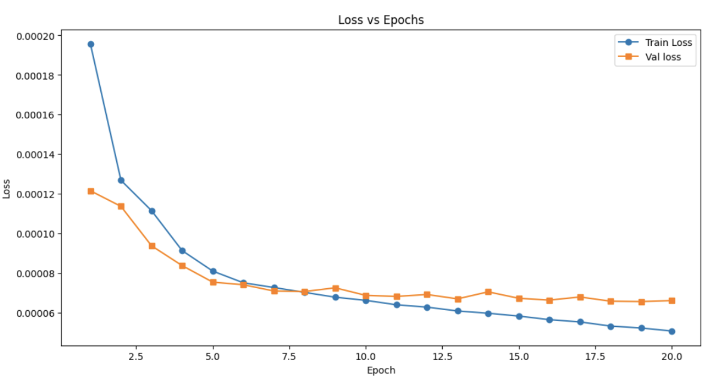
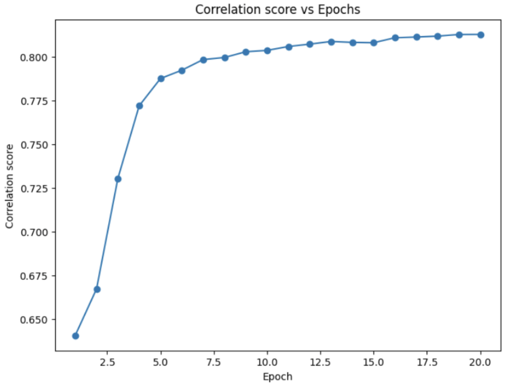
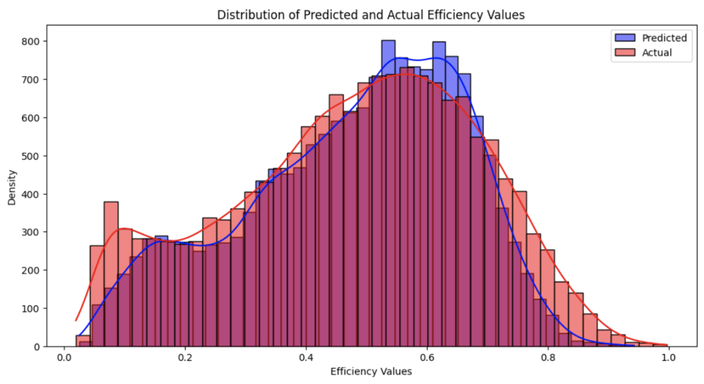

# Predicting sgRNA efficiency using Deep Learning

## Background 
As the precision medicine revolution makes its way out of academia towards the clinic, Clustered regularly interspaced
short palindromic repeats (CRISPR)/CRISPR-associated protein 9 (Cas9) gene-editing technology has been considered to
be the ideal tool for the treatment of monogenic diseases. The ability to edit disease-causing genes to suppress gene function
holds tremendous value in the field of medical science, especially in the treatment of diseases like HIV, muscular dystrophy,
autism, and rare monogenic diseases. Machine learning models can be used to predict guide RNA efficiency in CRISPR-
Cas9 systems.

With the help of a single guide RNA (sgRNA), the CRISPR-Cas9 system binds to the target portion of the gene followed
by the action of the Cas9 endonuclease that introduces a double-stranded break in the target gene. This triggers the cell’s
endogenous DNA repair pathway, thereby introducing an insertion or deletion at the cleavage site, impacting the gene’s
function. The sgRNA plays a pivotal role in this process. This 20-nucleotide sequence, designed to be complementary to
the intended target gene, guides the Cas9 enzyme system to the precise location in the DNA that requires modification. The
efficiency of the gene-editing process relies on the sgRNA's accuracy in guiding the CRISPR-Cas9 system to the target
gene site.


This repository contains code for comparing various machine learning models, including Multi-Layer Perceptron (MLP), DNABert+MLP, Bidirectional Long Short-Term Memory (BiLSTM), and Transformer, to predict the on-target efficiency of single-guide RNA (sgRNA) sequences for the CRISPR-Cas9 system. The models take as input sequences of the sgRNA (including the gRNA and PAM sequences) and output the predicted efficiency score.

Given the nature of our dataset, which consists of relatively short sequences (sgRNA sequences of length 23) and a regression task (predicting efficiency scores), the bidirectional LSTM (BiLSTM) architecture gave us the best results with a Spearman correlation score of 0.813 amongst all the models.

# sgRNA Efficiency Prediction using BiLSTM

## Data
The data used in this experiment comes from the 41467_2019_12281_MOESM3_ESM dataset which is also labeled as
Supplemental Data 2 in the paper by Wang, D. et alviii. This data was obtained by inducing mutations on Cas9 nucleases on
LentiCas9-blast plasmid, resulting in the generation of plasmids expressing eSpCas9 and SpCas9-HF1. Subsequently,
gRNAs targeting coding sequences and microRNAs were designed, and their respective oligonucleotides were synthesized
via PCR amplification. Utilizing this plasmid library, gRNA activity profiles were generated for WT-SpCas9, eSpCas9, and
SpCas9-HF1. The genomic DNA was extracted and the integrated target regions were PCR amplified for deep sequencing,
enabling the detection of indels at the integrated target sites. Valid gRNA indel rates for WT-SpCas9, eSpCas9, and SpCas9-
HF1 were then documented and published in Supplemental Data 2viii
.

## Requirements

- Python 3.6+
- PyTorch
- Pandas
- NumPy
- Matplotlib
- Seaborn
- Scikit-learn

## Usage

1. Clone the repository or copy the code into a Python file.
2. Make sure you have the required dependencies installed.
3. Run the Python script. It will train the BiLSTM model for a specified number of epochs (default is 20) and print the training loss, validation loss, and validation Spearman's correlation coefficient for each epoch.

```python
python3 bilstm.py
```
4. After training, the script will generate the following plots and save them as PNG files:
- loss.png: A plot of training and validation losses over epochs.

- cor.png: A plot of validation Spearman's correlation coefficient over epochs.

- Distribution.png: A histogram plot showing the distribution of predicted and actual efficiency values for the validation set.


## Results
Our analaysis showed that a BiLSTM Architecture worked best out of all the models. 
The input to the model consists of one-hot sgRNA sequences and handles padding or truncation to achieve a fixed sequence
length of 23 (20 for gRNA_Seq + 3 for PAM). The input size is 92 (for each of the 4 nucleotides A, C, G, T).
The biLSTM model has 128 hidden units and 2 layers. The output of the biLSTM was passed through three fully connected
layers with ReLU activations and dropout regularization. The final output was a single value representing the predicted
CRISPR-Cas9 efficiency score.
The model is trained using the PyTorch training loop, computing the mean squared error(MSE) loss and Spearman
correlation between predicted and true efficiency scores on the training and validation sets. The losses and correlation scores
are logged per epoch. After performing hyperparameter tuning using Optuna, the best setup had a batch size of 200, a
learning rate of 0.001, a dropout rate of 0.2, and ran for 20 epochs. After training, the training losses, validation losses and
validation Spearman correlations were plotted against the number of epochs.


## Contributing
Contributions to improve the code or add new features are welcome! Please feel free to submit a pull request or open an issue for any suggestions or bug reports.

## References
Ang, D., Ang, Y. Y., Lau, W. Y., Lau, J. K., Tan, Y. H., Zhang, C., ... & Leong, C. W. (2019). Machine learning-guided massively parallel crRNA identification for genome editing. Nature Methods, 16(10), 949-952.
